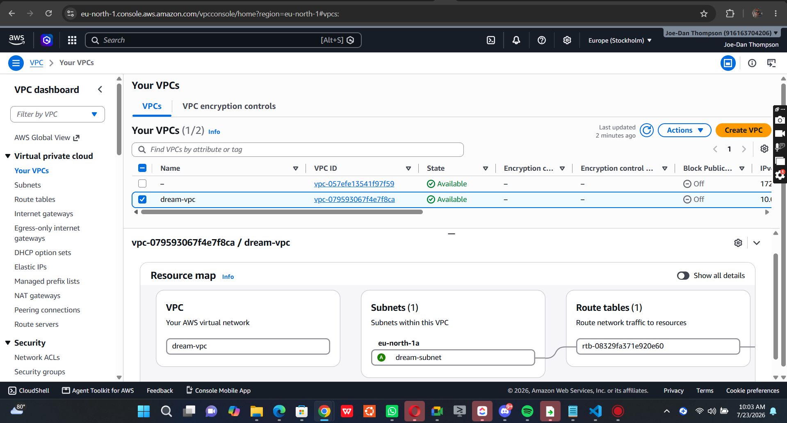
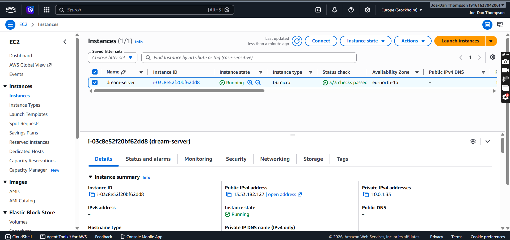
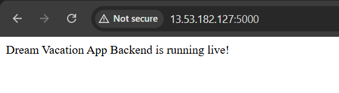
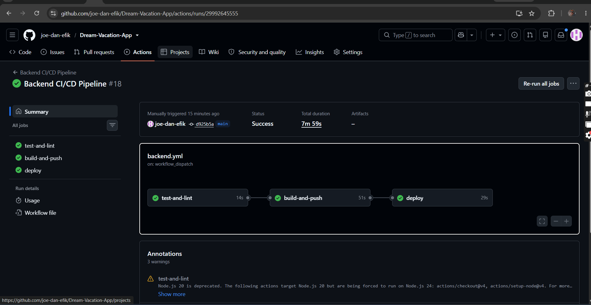

# Dream Vacation App - AWS Deployment & CI/CD Pipeline

This repository contains the deployment configuration and automated CI/CD pipeline for the **Dream Vacation App**, hosted on AWS EC2 within a custom VPC infrastructure.

---

## 🏗️ Architecture & Network Setup

* **VPC:** `dream-vpc` (`10.0.0.0/16`)
* **Subnet:** `dream-subnet` (`10.0.1.0/24`)
* **Internet Gateway:** `dream-igw`
* **Route Table:** `dream-rt`
* **Compute:** AWS EC2 (`t3.micro` / Ubuntu) running Docker & Docker Compose

---

## 📋 Deliverables & Verification

### 1. Custom VPC and Subnet Configuration

### 2. EC2 Instance Running Status

### 3. Application Running Live in Browser

### 4. Successful CI/CD Deployment Pipeline

---

## 🚀 CI/CD Workflow Overview

The GitHub Actions pipeline automates testing, container image publishing, and EC2 deployment:

1. **Test & Lint:** Validates code syntax and runs test suites.
2. **Build & Push:** Packages the Node.js application into a Docker container and pushes it to Docker Hub (`joedaneffiong/dream-vacation-backend`).
3. **Deploy:** Connects via SSH to the AWS EC2 instance, transfers `docker-compose.yml`, pulls the updated image from Docker Hub, and spins up the live container using Docker Compose.